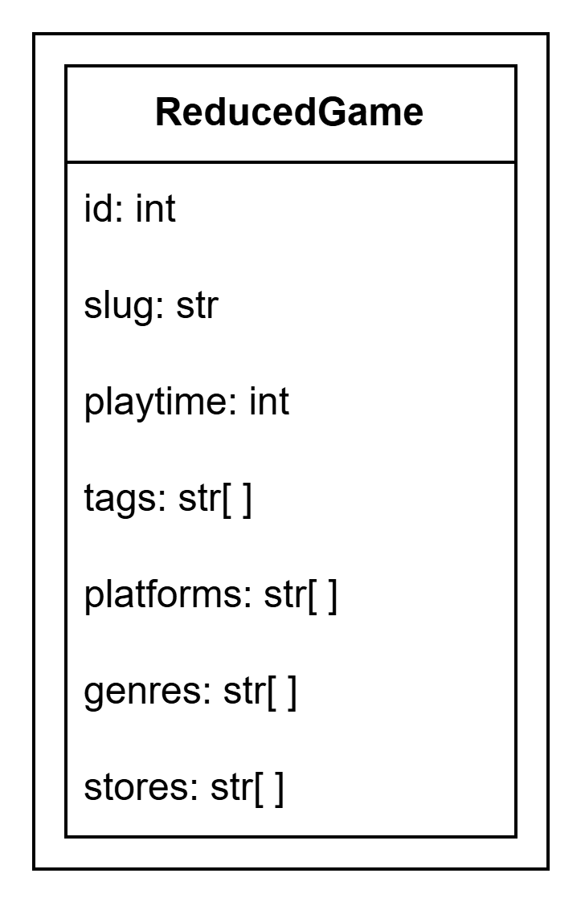
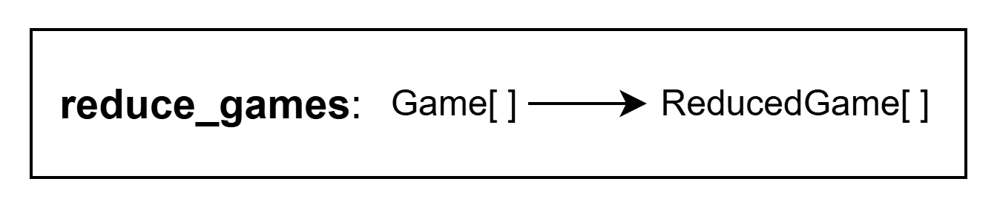
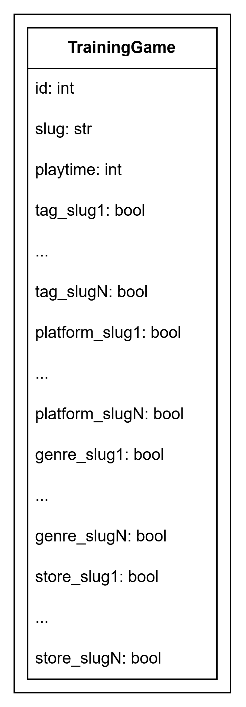

# game_rating_predictor
This is the project that trains an ml model that will predict game rating. The train data comes from RAWG api: https://rawg.io/apidocs.

api docs can be found at site: https://api.rawg.io/docs/#operation/games_list (February 5, 2026)

request is to be used https://api.rawg.io/api/games?key=secret&dates=2024-02-05,2025-02-05

plan:
- describe a data that I will get (make a type notation in README so it will be clear about data that I use and then write a simple version that will be used to train a model)
- fetch games that was realized for last year (so 2025-02-05 can be shifted, take today date and then substract one and two year e.g. from 2024 to 2025 so no early games from 2025 to 2026 so we can predict more honestly)
- prepare data to be saved in .csv file (make some things more simpler, reshape data structure)
- put fetched games in .csv file
- use this .csv to train model (I want to optimize MSE metric, so we can use kind of Regression: predict rating) (80/20)
- save the scores of model into .json/.csv file 
- make a file that will use saved params so then we can just predict game rating by our .csv data
- make refactoring of these codes (fetcher_data, training_data, model_predictor), be sure that they work after refactoring

The table of responsibility:
| File | Responsibility |
| ---- | -------------- |
| model_predictor.py  | Predicting rating of games with scores |
| training_model.py   | Generating scores with retrieved games |
| retrieving_data.py  | Retrieving games with RAWG API |
| games_api.py        | Handling requests to RAWG API  |
| request_instance.py | General class for creating API classes |

