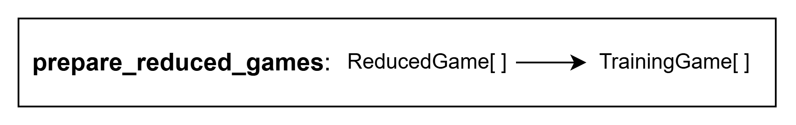
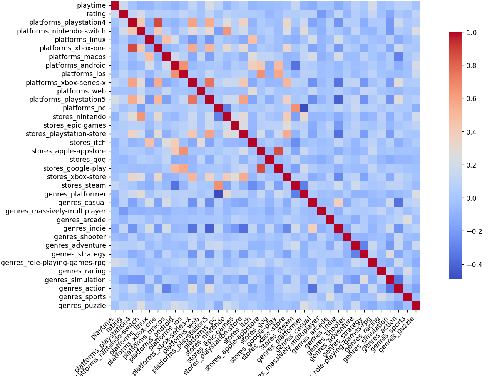
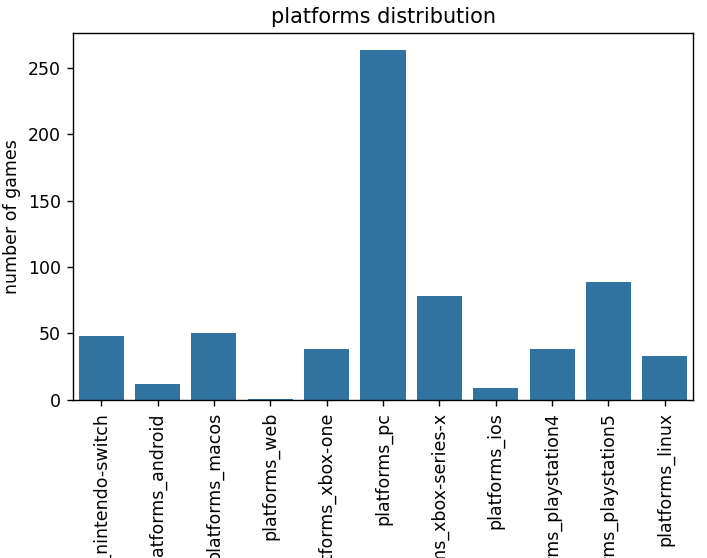
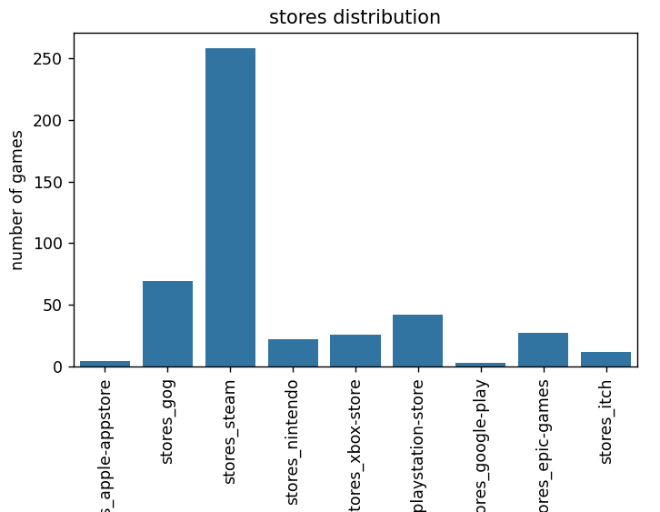
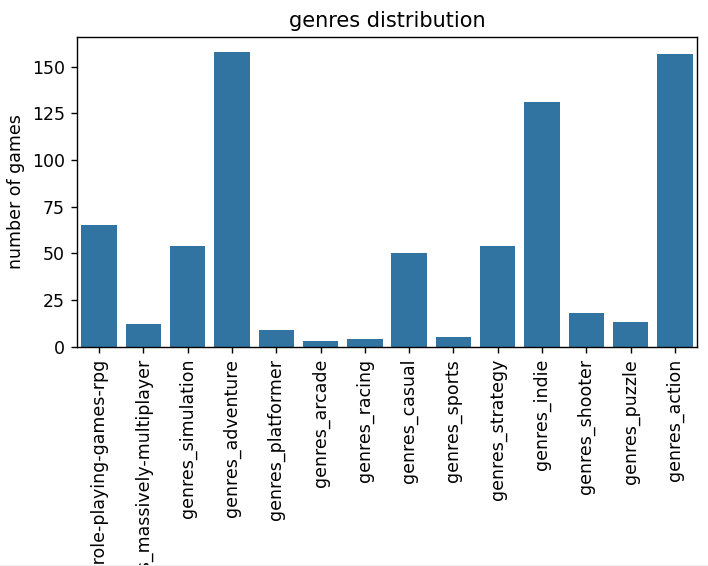
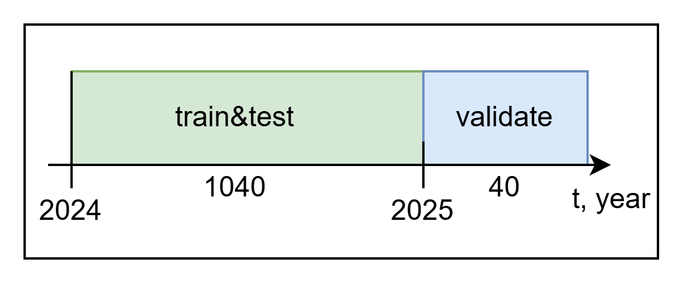
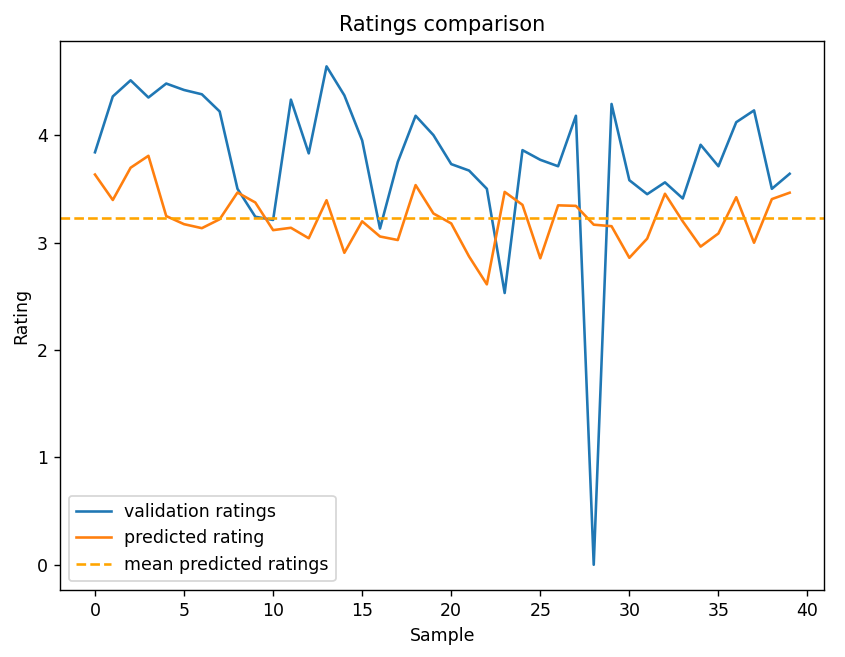

# game_rating_predictor
This is the project that trains an ml model that will predict game rating. The train data comes from RAWG api: https://rawg.io/apidocs.

## General project description

The project aims at developing machine-learning model that can predict a rating of game. Games are retrieved by using RAWG API: https://rawg.io/apidocs (February 11, 2026). Also this project aims at gathering more information about parameters that influence a rating of games. Python (the version is 3.13.7) and libraries scikit-learn, pandas and seaborn are used to achieve these goals. 

The table of files' responsibilities:
| File | Responsibility |
| ---- | -------------- |
| main.py             | Launching all project flow up to predicting ratings |
| model_predictor.py  | Predicting rating of games with scores |
| training_model.py   | Generating scores with retrieved games |
| utils.py            | Preparing games to use in training |
| reducing_games.py   | Reducing games to readable form |
| retrieving_data.py  | Retrieving games with RAWG API |
| games_api.py        | Handling requests to RAWG API  |
| request_instance.py | General class for creating API classes |

### Retrieving Data
RAWG API suggests the following structure of data (for the endpoint "/games"). The property playtime gives number of hours that usually take to complete a game. The slug parameter is preferred to name, because it is unique; the slug is preferred to id, because it is more informative. The green color shows properties that will be interesting to use for predicting rating, the yellow color shows filters that will be used to retrieve data (realese date and language of tags, we will use only english tags), the orange color shows properties that depend on rating itself so we will remove these properties for sure. The files that work with API are `request_instance.py`, `games_api.py` and `retrieving_games.py` (the pattern Adapter was used to create the architecture of this piece of project, i.e. creating middleware class between library and using interface).

### Reducing Data
Then we reduce our games list from api to more convenient shape. The following image shows this shape that will be convenient to store in csv file. This function is important to work correctly cause it is a bridge between API and our research so tests were made for them (in the folder `tests`, to launch them check Launching paragraph; this piece of project was created according to methodology TDD(TestDrivenDevelopment) and AAA(Arrange, Act, Assert)). The file that contains this function is `reducing_games.py`. 

### Preparing Data
After reducing games we prepare them for the research. We unfold properties such as stores, platforms and genres so then it will be easy to analyze them. The file that contains the function to prepare games is `utils.py`.

### Training models
Prepared data is used to train models and then compare them. As training data we use games that were realesed between 2024 and 2025 year. MSE and R2 scores are metrics that were chosen for optimizing. The table below shows the results of training in specific conditions (No PCA&Tags, only PCA, PCA&Tags - where PCA is personalized components analysis, Tags is the parameter of games). Before training playtime was scaled by MinMaxScaler (to make this param smooth, there are a lot of games where playtime is more than 100 hours and less than 20 hours). Removing Tags parameter was considered by number of its unique props. The best result in the table belongs to Linear Regression with PCA only. All models have negative R2 metric, but they have good (less than 1) mse. The reason will be discovered on the test games: games from current year. The file that trains model is `training_model.py`.

| Model | No PCA&Tags | PCA | PCA&Tags |
| ----------- | -------- | --------- | ------ |
| Linear Regression | 0.607, -0.508 | 0.408, -0.015 | 1.028, -1.463 |
| Decision Tree | 0.733, -0.822 | 0.717, -0.781 | 0.686, -0.644 |
| Random Forest | 0.424, -0.053 | 0.588, -0.462 | 0.444, -0.063 |
| SVR Poly | 0.441, -0.095 | 0.459, -0.140 | 0.440, -0.054 |
| SVR RBF  | 0.440, -0.092 | 0.455, -0.132 | 0.485, -0.161 |

### Predicting results
Firstly, the heat matrix was created to see dependencies between parameters (for training data). It seems that rating has weak dependencies on other parameters, it might be the reason of such "weak" trained models (by metric R2). The most correlated parameters to rating: platforms_nintendo_switch, genres_role-playing-games-rpg, genres_simulation and genres_massively-multiplayer. First two give positive correlation, other two give negative correlation: so if the game is on nintendo switch and rpg it might have better ratings than simulation or massively-multiplayer game. The other interesting things: pc, steam and platformer genre are negative correlated (so it means there usually a little games on pc/steam with platformer genre), android and steam are negative correlated (a little games that are in steam and available on android), xbox-one (series-x) and playstation 4 (5) are positive correlated (if there's a game on xbox-one, it might be this game is on playstation 4), android and ios are positive correlated, pc and steam are positive correlated.  

There are platforms, stores and genres distribution charts are presented. They are built by training data. As we can see the most games are on pc and in steam. The most popular genres are action and adventure from 2024 to 2025 years. 

The data for validating results is taken from this year. The data distribution is shown in the following image (where numbers 1040 and 40 present the size of each sample).

The best model (Linear Regression without Tags with PCA) gives the following prediction results that are show in chart. As we can see our model gives almost just average value, so it proves that it has low R2 score (negative!), but it has good MSE metric. So negative R2 score indicates low predictive abilities of models.

Conclusion: MSE is not enough to grade model, r2 helps to show that our values aren't just avg (our models give avg value so it gives good MSE)

## Launching instructions
First you should define a virtual environment (basic module venv of python is used), in the root directory of the project run these commands in your terminal to create and activate the virtual environment:

`python -m venv venv`

`.\venv\Scripts\activate`

After that run the following command to install required packages for this projects:

`pip install -r req.txt`

Then run `pip install -e .` in the root of the project so you can setup the "importing" paths between the folders src and tests.

### Running project
To run project go to src folder and run:

`python main.py 0 0`

In case you've downloaded already files you can use `1 1` at the end so you can prevent pulling train and test data from RAWG api. In case you want to see charts: go to the file `src/main.py` and put flags `include_charts` and `include_ratings_plot` to `True`. 

Actually you can run only training file (put 1 at the end if you'd like to see charts):

`python training_model.py 1`

### Running tests
To run all tests you should run this command in the root of the project:

`pytest tests`